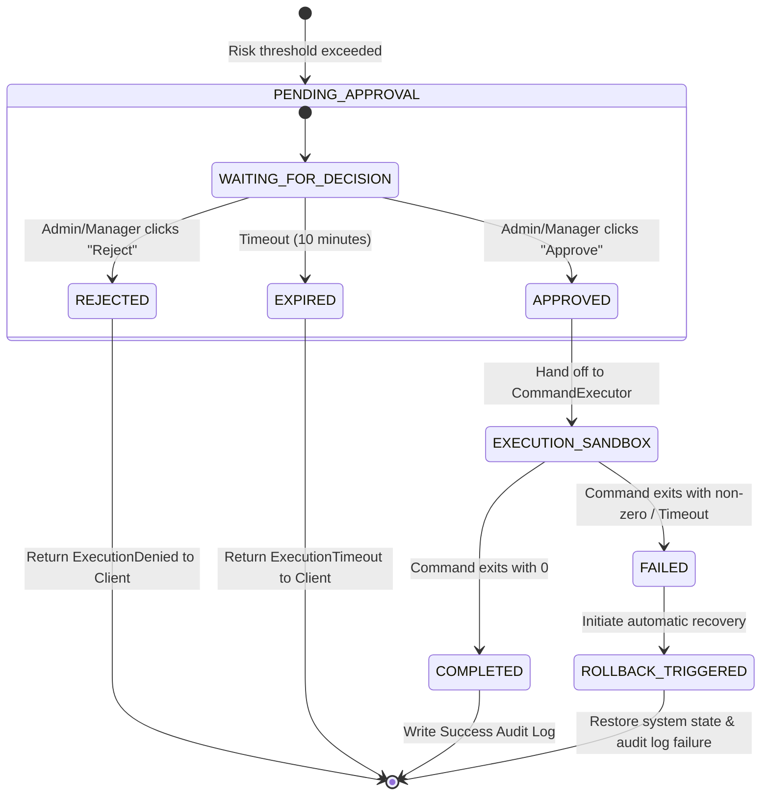

# SAFEOPS MCP: Comprehensive Architecture Knowledge Base

This document serves as the official, production-grade technical specification and architecture knowledge base for **SAFEOPS MCP** (Safe Operations Model Context Protocol). It outlines the architecture, logic, code patterns, and security guardrails necessary to build a secure governance layer between AI coding agents and critical infrastructure.

---

## 1. Executive Summary & Core Philosophy

AI coding agents (e.g., Claude Code, Cursor, Windsurf, Antigravity) are designed to solve complex software engineering and systems administration tasks. However, providing these agents with direct, unrestricted shell access (e.g., `sudo bash` or ssh access to production systems) creates severe security vulnerabilities:
1. **Malicious or Erratic Behavior**: An agent could execute destructive commands (`rm -rf /`, formatting disks, shutting down critical databases) due to hallucination or compromised prompts.
2. **Privilege Escalation**: An agent could download external malware, modify shadow files, or open unauthorized ports.
3. **Lack of Auditability**: Direct shell histories are easily modified, spoofed, or cleared, violating compliance standards (SOC 2, ISO 27001).
4. **Data Exfiltration**: Agents could search for env files, secrets, or customer PII, and send them to external servers via `curl`.

**SAFEOPS MCP** solves this by inserting a Zero-Trust governance proxy layer between the agent and the target infrastructure. 

```text
+-----------------------+
|  AI Agent (Client)    |
+-----------------------+
            |
            | (MCP Protocol: JSON-RPC over Stdio/SSE)
            v
+-----------------------+
|  SAFEOPS MCP Server   |
+-----------------------+
            |
            | (Internal API Call with Auth Token)
            v
+-------------------------------------------------------+
|                 SAFEOPS FastAPI Backend               |
|                                                       |
|  +--------------------+       +--------------------+  |
|  |   Safety Layer     | ----> |   Policy Engine    |  |
|  +--------------------+       +--------------------+  |
|            |                             |            |
|            v                             v            |
|  +--------------------+       +--------------------+  |
|  |   Risk Engine      | ----> |   Approval Engine  |  |
|  +--------------------+       +--------------------+  |
+-------------------------------------------------------+
            |
            | (Execution Authorized or Approved)
            v
+-----------------------+
|   Rollback Snapshot   | (E.g. PG Dump, Git Commit, LVM snapshot)
+-----------------------+
            |
            v
+-----------------------+
|   Execution Sandbox   | (Isolated Docker / restricted cgroup)
+-----------------------+
            |
            v
+-----------------------+
|  Target Infrastructure|
+-----------------------+
            |
            v
+-----------------------+
|  Cryptographic Audit   | (Immutable Blockchain-style SHA256 Chain)
+-----------------------+
```

---

## 2. Module 1: MCP Server Specification (`safeops-mcp-server`)

The MCP Server implements the official Model Context Protocol (using the Python `mcp` SDK) and exposes a curated catalog of system administration tools.

### Protocol Implementation details
- **Channel**: Stdio transport (Standard Input / Standard Output) for local agents (Claude Code, Cursor) and SSE (Server-Sent Events) for remote configurations.
- **Client Authentication**: The MCP Client must provide a `bearer token` passed via environment variables (e.g. `SAFEOPS_API_TOKEN`) or custom headers.
- **Dynamic Tool Loading**: Upon initialization (`initialize` request), the MCP Server queries the backend API `/api/v1/tools` using its authentication token to dynamically fetch the tools allowed for its scope.

### Curated Tool Catalog

The following table details the standard suite of tools exposed by the MCP Server:

| Tool Category | Tool Name | Description | Risk Level | Rollback Strategy |
| :--- | :--- | :--- | :---: | :--- |
| **System** | `get_uptime` | Gets system uptime. | Low (1) | None |
| | `cpu_usage` | Gets real-time CPU utilization metrics. | Low (1) | None |
| | `ram_usage` | Gets memory utilization metrics. | Low (1) | None |
| | `disk_usage` | Gets disk space partition metrics. | Low (1) | None |
| | `system_health` | Combined health diagnostic (CPU, RAM, Disk, Load). | Low (1) | None |
| **Packages** | `check_updates` | Check for available package updates (APT/YUM/Pacman). | Low (2) | None |
| | `update_package` | Upgrades/installs a specific package. | Medium (5) | Package rollback registry / LVM snapshot |
| | `remove_package` | Uninstalls a package. | High (7) | Package state checkpoint |
| | `package_info` | Shows package metadata. | Low (1) | None |
| **Services** | `start_service` | Starts a systemd/docker service. | Medium (4) | Service stop command |
| | `stop_service` | Stops a systemd/docker service. | High (6) | Service start command |
| | `restart_service` | Restarts a systemd/docker service. | Medium (5) | Service restart |
| | `service_status` | Returns systemd/docker service details. | Low (1) | None |
| **Logs** | `recent_errors` | Searches system logs for errors or warnings. | Low (2) | None |
| | `journal_logs` | Fetches journald logs with pagination and filters. | Low (2) | None |
| | `application_logs` | Reads logs for specific registered app directories. | Low (2) | None |
| **Docker** | `docker_ps` | Lists running containers. | Low (2) | None |
| | `docker_restart` | Restarts a specific Docker container. | Medium (5) | Container status restoration |
| | `docker_logs` | Fetches stderr/stdout for a container. | Low (2) | None |
| | `docker_images` | Lists downloaded images. | Low (2) | None |
| | `docker_stats` | Real-time container resource streams. | Low (2) | None |
| **Kubernetes** | `list_pods` | Lists pods in a namespace. | Low (2) | None |
| | `restart_deployment` | Triggers a rollout restart of a Kubernetes deployment. | High (7) | Undo rollout (`kubectl rollout undo`) |
| | `deployment_status` | Status of deployments. | Low (2) | None |
| **Database** | `postgres_status` | Connects and executes health checks on postgres. | Low (2) | None |
| | `backup_database` | Runs pg_dump or database backup. | Medium (4) | Backup file tracking |
| | `restore_database` | Restores database from a snapshot. | Critical (9) | Backup current database before restore |
| **FastAPI** | `deploy_fastapi` | Deploys a new version of a FastAPI service. | High (7) | Swaps symlink to previous build |
| | `rollback_fastapi` | Reverts FastAPI application to last stable deploy. | Medium (5) | Swaps symlink forward |
| | `service_health` | Web status checks for APIs. | Low (1) | None |
| **n8n** | `restart_n8n` | Restarts the n8n automation service. | Medium (5) | Service restart |
| | `workflow_status` | Checks workflow logs and statuses. | Low (2) | None |

### Tool Structure (JSON Schema Example)

Below is the structured tool schema payload defined by the MCP server for a dangerous action, e.g. `restart_service`:

```json
{
  "name": "restart_service",
  "description": "Restarts a systemd or docker service on the host machine.",
  "inputSchema": {
    "type": "object",
    "properties": {
      "service_name": {
        "type": "string",
        "description": "The name of the service to restart (e.g., 'nginx', 'postgresql')."
      },
      "provider": {
        "type": "string",
        "enum": ["systemd", "docker"],
        "default": "systemd",
        "description": "The service provider type."
      }
    },
    "required": ["service_name"]
  },
  "metadata": {
    "required_permission": "services:restart",
    "base_risk": 5.0,
    "rollback_available": true
  }
}
```

---

## 3. Module 2: Policy & Access Control Engine

The Policy Engine determines if a requested tool execution is authorized. It operates on a combined Role-Based Access Control (RBAC) and Attribute-Based Access Control (ABAC) architecture.

### Policy Rules Evaluation Flowchart

```text
[Incoming Execution Request]
            |
            v
[Check Client Authentication] --- Invalid ---> [Return 401 Unauthorized]
            |
        Valid Token
            v
[Load Client Metadata & Role]
            |
            v
[Query RBAC Policies Table]
            |
   Does Role have permission?
      /                   \
    No                    Yes
    /                       \
   v                         v
[Deny (403 Forbidden)]   [Load Context Variables (IP, Time, Env)]
                             |
                             v
                         [ABAC Evaluation]
                         - Is Client IP in whitelist?
                         - Is action performed in staging or prod?
                         - Are constraints matched?
                             |
                  +----------+----------+
                  |                     |
               Passed                Failed
                  |                     |
                  v                     v
            [Evaluate Risk]      [Deny (403 Forbidden)]
```

### Context-Aware Policy Schema
Policies are defined as JSON structures stored in the database.

```json
{
  "policy_id": "pol_ops_nginx_restart",
  "description": "Allow operators to restart nginx in staging automatically, but require approval in production.",
  "role": "operator",
  "tool": "restart_service",
  "rules": {
    "conditions": [
      {
        "field": "arguments.service_name",
        "operator": "equals",
        "value": "nginx"
      },
      {
        "field": "context.client_ip",
        "operator": "in_network",
        "value": "10.0.0.0/16"
      }
    ],
    "environment_overrides": {
      "development": {
        "effect": "allow"
      },
      "staging": {
        "effect": "allow"
      },
      "production": {
        "effect": "approval_required",
        "approver_role": "admin"
      }
    }
  }
}
```

---

## 4. Module 3: Dynamic Risk Engine

The Risk Engine calculates a dynamic, decimal score ranging from `0.0` to `10.0` to represent the severity/risk of executing the tool under the current system context.

### Risk Formulation

The dynamic score is computed using the following equation:

\[
R_{\text{score}} = \min\left(10.0, R_{\text{base}} \times M_{\text{env}} \times \left(1.0 + F_{\text{history}}\right) \times W_{\text{system}}\right)
\]

Where:
- \(R_{\text{base}}\): Base risk score assigned to the tool configuration (from `1.0` to `10.0`).
- \(M_{\text{env}}\): Environment multiplier based on the target execution environment:
  - `development` = \(0.5\)
  - `staging` = \(1.0\)
  - `production` = \(2.0\)
- \(F_{\text{history}}\): Historical failure weight factor calculated from audit logs over the last 30 days:
  \[
  F_{\text{history}} = \min\left(0.5, \frac{\text{Failed Executions of Tool}}{\text{Total Executions of Tool} + 1}\right)
  \]
- \(W_{\text{system}}\): Criticality weight of the target system (e.g. database server = 1.25, proxy = 1.0, secondary task worker = 0.8).

### Python Risk Engine Code Draft

```python
import math
from typing import Dict, Any

class RiskEngine:
    def __init__(self, db_session):
        self.db = db_session

    def calculate_historical_failure_rate(self, tool_name: str) -> float:
        # DB Query: Count total runs and failed runs in the last 30 days
        # For simulation, return a mock rate if DB has no historical data.
        total_runs = 10
        failed_runs = 1
        return failed_runs / (total_runs + 1)

    def assess_risk(self, tool_metadata: Dict[str, Any], context: Dict[str, Any]) -> Dict[str, Any]:
        base_risk = tool_metadata.get("base_risk", 1.0)
        env = context.get("environment", "development").lower()
        
        # Determine environment multiplier
        env_multipliers = {
            "development": 0.5,
            "staging": 1.0,
            "production": 2.0
        }
        m_env = env_multipliers.get(env, 1.0)
        
        # Fetch historical failure rate
        tool_name = tool_metadata.get("name")
        f_history = self.calculate_historical_failure_rate(tool_name)
        
        # Target system criticality weight
        system_criticality = context.get("system_criticality", 1.0)
        
        # Calculate score
        score = base_risk * m_env * (1.0 + f_history) * system_criticality
        score = min(10.0, round(score, 2))
        
        # Generate human-friendly explanation
        explanation = f"Base tool risk is {base_risk}. Environment is {env} ({m_env}x multiplier). "
        if f_history > 0.05:
            explanation += f"This tool has a historical failure rate of {f_history:.1%}. "
        if system_criticality > 1.0:
            explanation += f"Target system is categorized as critical (weight: {system_criticality}x)."
            
        return {
            "risk_score": score,
            "explanation": explanation
        }
```

---

## 5. Module 4: Multi-Stage Approval Engine & Dashboard

When the Policy Engine or Risk Engine flags an action as `APPROVAL_REQUIRED` (or when the risk score exceeds defined thresholds), the execution is suspended, and an approval ticket is generated.

### Execution Thresholds
- **\(R_{\text{score}} < 3.0\)**: Auto-execute. No human intervention needed.
- **\(3.0 \le R_{\text{score}} < 7.0\)**: Requires Manager approval. The agent gets suspended. A WebSocket notification is pushed to active manager accounts.
- **\(R_{\text{score}} \ge 7.0\)**: Requires Admin approval. Strict execution block.

### Workflow State Transitions



---

## 6. Module 5: Execution Sandbox Architecture

Unrestricted shells (`subprocess.Popen(..., shell=True)`) are forbidden. Commands must be run inside a sandboxed environment with strict resource limits and namespaces.

### CommandExecutor Abstraction
The backend defines a `CommandExecutor` base class that wraps command execution.

### Docker Sandbox Implementation (`docker_sandbox.py`)
This implementation uses the official Docker Python SDK to spawn a transient, hardened container.

```python
import docker
from docker.errors import ContainerError, ImageNotFound
import tempfile
import os

class DockerSandboxExecutor:
    def __init__(self, image: str = "alpine:latest", timeout: int = 30):
        self.client = docker.from_env()
        self.image = image
        self.timeout = timeout

    def execute(self, cmd_args: list[str], env: dict[str, str] = None, read_only_root: bool = True) -> dict[str, Any]:
        """
        Executes a command inside an isolated container with resource limits.
        """
        # Ensure command args are safe (no shell injections)
        if not cmd_args or not isinstance(cmd_args, list):
            raise ValueError("cmd_args must be a non-empty list of strings.")

        # Create temporary working directory to mount for writing
        with tempfile.TemporaryDirectory() as tmp_dir:
            try:
                # Spawn container
                container = self.client.containers.create(
                    image=self.image,
                    command=cmd_args,
                    environment=env or {},
                    network_mode="none", # Disables network access to prevent exfiltration
                    mem_limit="512m",   # Limit RAM to 512MB
                    nano_cpus=500000000, # Limit CPU to 0.5 cores (500 million nanoseconds)
                    read_only=read_only_root, # Prevent modifications to filesystem root
                    volumes={
                        tmp_dir: {"bind": "/workspace", "mode": "rw"}
                    },
                    working_dir="/workspace",
                    user="1000:1000" # Run as non-root user
                )

                # Start container
                container.start()

                # Wait for container execution with timeout
                result = container.wait(timeout=self.timeout)
                exit_code = result.get("StatusCode", -1)

                # Capture logs
                stdout = container.logs(stdout=True, stderr=False).decode("utf-8")
                stderr = container.logs(stdout=False, stderr=True).decode("utf-8")

                # Clean up container
                container.remove()

                return {
                    "exit_code": exit_code,
                    "stdout": stdout,
                    "stderr": stderr,
                    "error": None
                }

            except docker.errors.ContainerError as ce:
                return {
                    "exit_code": ce.exit_code,
                    "stdout": "",
                    "stderr": ce.stderr.decode("utf-8") if isinstance(ce.stderr, bytes) else str(ce.stderr),
                    "error": "ContainerError"
                }
            except Exception as e:
                # Catch timeout or docker errors
                return {
                    "exit_code": -1,
                    "stdout": "",
                    "stderr": "",
                    "error": str(e)
                }
```

---

## 7. Module 6: Automating Rollbacks & Backups

To maintain operational stability, the platform executes pre-action backups and can restore the system to a clean checkpoint if an action fails or causes downtime.

### Pre-Action Checkpoint Strategies
Before running a tool with high base risk or system impact:
1. **Database snapshot (`postgres_status`/`restore_database`)**: Runs `pg_dump` of the target database schema/tables and stores the `.sql` archive in a local encrypted backup folder.
2. **App Deployment rollback (`deploy_fastapi`)**: Maintains a versioned directory structure (e.g., `/app/releases/v1`, `/app/releases/v2`) and swaps a symbolic link `/app/current` to point to the new build. If the service health check fails, it immediately points `/app/current` back to the previous release.
3. **Container snapshot (`docker_restart`)**: Employs image tags or commits current container state to a rollback image before applying configurations.

### Rollback Lifecycle Diagram

```text
               [Initiate Write/Update Tool]
                            |
                            v
            [Lookup Snapshot Strategy for Tool]
                            |
                            v
            [Generate Backup Snapshot / Archive]
                            |
           Is Snapshot successful?
             /                  \
           Yes                  No
           /                      \
          v                        v
[Run Sandboxed Command]        [Abort Tool Run, return Error]
          |
  Execution Outcome?
     /          \
  Success     Failure
   /              \
  v                v
[Save Audit]   [Trigger Rollback Handler]
                   |
                   v
               [Restore System to Snapshot Checkpoint]
                   |
                   v
               [Log Rollback Event & Alert Admin]
```

---

## 8. Module 7: Immutable Audit Logging

Compliance standards dictate that all operational logs must be immutable. SAFEOPS MCP implements a cryptographic audit ledger where each record contains a cryptographic checksum linking it to the historical chain.

### Cryptographic Hashing Design
The audit log table calculates:

\[
H_i = \text{SHA256}\left( H_{i-1} \parallel \text{Timestamp}_i \parallel \text{User}_i \parallel \text{Client}_i \parallel \text{Tool}_i \parallel \text{Args}_i \parallel \text{Status}_i \parallel \text{ResultHash}_i \right)
\]

If any row is modified or deleted, the hash chain breaks, immediately triggering a security alert on the dashboard.

### Audit Log Schema Columns
- `id` (UUID Primary Key)
- `timestamp` (UTC datetime)
- `user_id` (UUID) - User requesting execution
- `client_id` (UUID) - Registered client token used
- `tool_name` (String)
- `arguments_payload` (Encrypted JSON of input arguments)
- `exit_code` (Integer)
- `risk_score` (Numeric)
- `approved_by` (UUID, Nullable)
- `previous_row_hash` (String)
- `current_row_hash` (String)

---

## 9. Module 8: AI Safety Layer

The AI Safety Layer sits at the entry point of the FastAPI backend. It parses raw client command payloads to detect malicious intent or command injection before invoking policies.

### Core Safeguards
- **Regex & Keyword Blocks**: Flags blacklisted terms (e.g. `rm -rf`, `mkfs`, `dd if=`, `nc -e`, `chmod -R 777`).
- **Path Traversal Checker**: Checks all file path arguments to ensure they do not contain path traversal characters (`..`, `/etc/shadow`, `/var/run/docker.sock`).
- **Semantic Classification**: Uses a lightweight classifiers model to assign an intent severity: `Safe`, `Caution`, `Dangerous`, `Critical`.

### Safety Classification Criteria
- **Safe**: Read-only queries, system usage stats, uptime checks.
- **Caution**: Service restarts, searching package lists, checking active deployments.
- **Dangerous**: Installing new software, removing packages, stopping main databases, changing config files.
- **Critical**: Kernel updates, formatting disk drives, direct database restoring, bulk exfiltration of user tables.

---

## 10. Module 9: MCP Client Registry

To govern multiple external integrations, SAFEOPS MCP tracks every connected client.

### Client Profiles
A client token has an assigned profile:
- **Claude Code**: Assigned the `developer` role. Permitted to read logs, check uptime, and restart services on staging automatically. Production actions require manager approval.
- **Windsurf Developer**: Assigned the `operator` role. Permitted to manage FastAPI deployments and package updates.
- **Local Cursor Agent**: Assigned the `reader` role. Read-only permissions on all systems. No execution allowed.

---

## 11. Module 10: Infrastructure Dashboard Design

The dashboard is built using Next.js 15, structured as an enterprise security platform. It uses a dark, high-contrast cybersecurity theme.

### Frontend Folder Structure

```text
frontend/
├── package.json
├── tailwind.config.js
├── src/
│   ├── app/
│   │   ├── layout.tsx         # Side navigation and global layout structure
│   │   ├── page.tsx           # Overview page (Health, approvals, metrics)
│   │   ├── approvals/
│   │   │   └── page.tsx       # WebSocket-powered pending approvals list
│   │   ├── audit/
│   │   │   └── page.tsx       # Paginated audit logs table with search
│   │   ├── policies/
│   │   │   └── page.tsx       # Policy and RBAC editing forms
│   │   ├── tools/
│   │   │   └── page.tsx       # Tool catalog and base risk modifier settings
│   │   ├── agents/
│   │   │   └── page.tsx       # Client registry and API token generation
│   │   └── rollbacks/
│   │       └── page.tsx       # History of rollback checkpoints
│   ├── components/
│   │   ├── ui/                # shadcn components (Button, Dialog, Badge, Card)
│   │   ├── DashboardStats.tsx # Overview graphs and status indicators
│   │   └── ApprovalCard.tsx   # Detailed request audit viewer for approving
│   └── lib/
│       ├── api.ts             # Axios/Fetch config with JWT handling
│       └── utils.ts           # Styling helper classes (cn, tailwind-merge)
```

---

## 12. Database Schema (SQLAlchemy Models)

The following schema defines the core entity structure for the PostgreSQL database:

```python
from sqlalchemy import Column, String, Integer, Float, ForeignKey, DateTime, Boolean, Text
from sqlalchemy.dialects.postgresql import UUID, JSONB
from sqlalchemy.ext.declarative import declarative_base
from sqlalchemy.orm import relationship
import uuid
import datetime

Base = declarative_base()

class Role(Base):
    __tablename__ = "roles"
    id = Column(UUID(as_uuid=True), primary_key=True, default=uuid.uuid4)
    name = Column(String(50), unique=True, nullable=False) # superadmin, admin, operator, reader
    description = Column(String(255))
    
    users = relationship("User", back_populates="role")

class User(Base):
    __tablename__ = "users"
    id = Column(UUID(as_uuid=True), primary_key=True, default=uuid.uuid4)
    email = Column(String(255), unique=True, nullable=False)
    hashed_password = Column(String(255), nullable=False)
    role_id = Column(UUID(as_uuid=True), ForeignKey("roles.id"), nullable=False)
    is_active = Column(Boolean, default=True)
    created_at = Column(DateTime, default=datetime.datetime.utcnow)
    
    role = relationship("Role", back_populates="users")
    approvals = relationship("ApprovalRequest", back_populates="approver")

class ClientRegistry(Base):
    __tablename__ = "mcp_clients"
    id = Column(UUID(as_uuid=True), primary_key=True, default=uuid.uuid4)
    name = Column(String(100), nullable=False) # e.g. "Claude-Production"
    api_token_hash = Column(String(255), unique=True, nullable=False)
    role_id = Column(UUID(as_uuid=True), ForeignKey("roles.id"), nullable=False)
    ip_whitelist = Column(Text) # CSV of allowed IPs/CIDRs
    created_at = Column(DateTime, default=datetime.datetime.utcnow)
    last_active = Column(DateTime)
    is_active = Column(Boolean, default=True)

class MCPTool(Base):
    __tablename__ = "mcp_tools"
    id = Column(UUID(as_uuid=True), primary_key=True, default=uuid.uuid4)
    name = Column(String(100), unique=True, nullable=False) # e.g. "restart_service"
    category = Column(String(50), nullable=False)
    description = Column(Text)
    base_risk = Column(Float, default=1.0)
    requires_approval_above = Column(Float, default=5.0)
    rollback_available = Column(Boolean, default=False)

class PolicyRule(Base):
    __tablename__ = "policies"
    id = Column(UUID(as_uuid=True), primary_key=True, default=uuid.uuid4)
    role_id = Column(UUID(as_uuid=True), ForeignKey("roles.id"), nullable=False)
    tool_id = Column(UUID(as_uuid=True), ForeignKey("mcp_tools.id"), nullable=False)
    environment = Column(String(50), default="*") # *, production, staging, development
    effect = Column(String(20), nullable=False) # allow, deny, approval_required
    rules_json = Column(JSONB) # Context-aware rules

class ToolExecution(Base):
    __tablename__ = "tool_executions"
    id = Column(UUID(as_uuid=True), primary_key=True, default=uuid.uuid4)
    client_id = Column(UUID(as_uuid=True), ForeignKey("mcp_clients.id"), nullable=False)
    tool_id = Column(UUID(as_uuid=True), ForeignKey("mcp_tools.id"), nullable=False)
    arguments = Column(JSONB)
    environment = Column(String(50), nullable=False)
    status = Column(String(50), default="PENDING") # PENDING_APPROVAL, EXECUTING, COMPLETED, FAILED, REJECTED
    exit_code = Column(Integer)
    stdout = Column(Text)
    stderr = Column(Text)
    created_at = Column(DateTime, default=datetime.datetime.utcnow)
    completed_at = Column(DateTime)
    
    approval = relationship("ApprovalRequest", back_populates="execution", uselist=False)
    risk_assessment = relationship("RiskAssessment", back_populates="execution", uselist=False)
    rollback = relationship("RollbackSnapshot", back_populates="execution", uselist=False)

class ApprovalRequest(Base):
    __tablename__ = "approvals"
    id = Column(UUID(as_uuid=True), primary_key=True, default=uuid.uuid4)
    execution_id = Column(UUID(as_uuid=True), ForeignKey("tool_executions.id"), nullable=False)
    status = Column(String(50), default="PENDING") # PENDING, APPROVED, REJECTED, EXPIRED
    reason = Column(Text)
    approver_id = Column(UUID(as_uuid=True), ForeignKey("users.id"), nullable=True)
    decided_at = Column(DateTime)
    created_at = Column(DateTime, default=datetime.datetime.utcnow)
    
    execution = relationship("ToolExecution", back_populates="approval")
    approver = relationship("User", back_populates="approvals")

class RiskAssessment(Base):
    __tablename__ = "risk_assessments"
    id = Column(UUID(as_uuid=True), primary_key=True, default=uuid.uuid4)
    execution_id = Column(UUID(as_uuid=True), ForeignKey("tool_executions.id"), nullable=False)
    risk_score = Column(Float, nullable=False)
    explanation = Column(Text)
    created_at = Column(DateTime, default=datetime.datetime.utcnow)
    
    execution = relationship("ToolExecution", back_populates="risk_assessment")

class AuditLog(Base):
    __tablename__ = "audit_logs"
    id = Column(UUID(as_uuid=True), primary_key=True, default=uuid.uuid4)
    timestamp = Column(DateTime, default=datetime.datetime.utcnow)
    user_id = Column(UUID(as_uuid=True), ForeignKey("users.id"), nullable=True)
    client_id = Column(UUID(as_uuid=True), ForeignKey("mcp_clients.id"), nullable=False)
    tool_name = Column(String(100), nullable=False)
    arguments_hash = Column(String(64))
    risk_score = Column(Float)
    approved_by = Column(UUID(as_uuid=True), ForeignKey("users.id"), nullable=True)
    status = Column(String(50))
    previous_hash = Column(String(64), nullable=False)
    row_hash = Column(String(64), nullable=False)

class RollbackSnapshot(Base):
    __tablename__ = "rollback_snapshots"
    id = Column(UUID(as_uuid=True), primary_key=True, default=uuid.uuid4)
    execution_id = Column(UUID(as_uuid=True), ForeignKey("tool_executions.id"), nullable=False)
    snapshot_type = Column(String(50)) # docker_image, postgres_dump, git_commit, directory_backup
    snapshot_target = Column(String(255)) # path or identifier
    created_at = Column(DateTime, default=datetime.datetime.utcnow)
    is_rolled_back = Column(Boolean, default=False)
    rolled_back_at = Column(DateTime)
    
    execution = relationship("ToolExecution", back_populates="rollback")
```

---

## 13. API Endpoint Specifications (FastAPI)

All endpoints reside under `/api/v1` and require authentication.

### Endpoint Catalog

- **`POST /api/v1/auth/login`**
  - **Description**: Authenticate dashboard users. Returns JWT access token.
  - **Payload**: `{ "email": "...", "password": "..." }`
  - **Response**: `{ "access_token": "...", "token_type": "bearer" }`

- **`GET /api/v1/tools`**
  - **Description**: Get all registered tools for the authenticated client.
  - **Response**: List of tool schemas.

- **`POST /api/v1/executions`**
  - **Description**: Trigger tool execution. Evaluates policies and risk.
  - **Payload**:
    ```json
    {
      "tool_name": "restart_service",
      "arguments": { "service_name": "nginx" },
      "environment": "production"
    }
    ```
  - **Responses**:
    - **`200 OK` (Auto-executed)**: Returns command output execution.
    - **`202 Accepted` (Approval Required)**: Returns `{ "status": "PENDING_APPROVAL", "approval_id": "UUID", "approval_url": "https://..." }`.
    - **`403 Forbidden`**: Blocked by policy.

- **`GET /api/v1/approvals`**
  - **Description**: Lists pending and resolved approvals. Filterable by status.

- **`POST /api/v1/approvals/{approval_id}/decide`**
  - **Description**: Approve or reject a request.
  - **Payload**: `{ "decision": "APPROVED" | "REJECTED", "reason": "Reason for decision" }`

- **`GET /api/v1/audit`**
  - **Description**: Query cryptographic audit trail logs. Supports CSV exports.

- **`POST /api/v1/clients`**
  - **Description**: Registers a new MCP client. Returns API key.

---

## 14. Production Deployment & Telemetry

### Infrastructure Stack (Docker Compose)
We orchestrate our dev/prod infrastructure via `docker-compose.yml` to bundle:
1. **API Backend**: FastAPI application container.
2. **Web Dashboard**: Next.js compiled frontend container.
3. **Database**: PostgreSQL database container.
4. **Caching & Queue**: Redis container.
5. **Observability**: Prometheus, Grafana, and OpenTelemetry collector to monitor service latencies, execution counts, risk warnings, and engine failures.

### Production Hardening Checklist
- [ ] Enforce strict TLS 1.3 on all endpoint routers.
- [ ] Implement Redis rate limiting to prevent denial of service (DoS) attacks on endpoints.
- [ ] Mount Docker sockets `/var/run/docker.sock` to the backend *only* under a restricted group scope.
- [ ] Verify that the database executes daily backups and matches encryption-at-rest.
- [ ] Set `SAFEOPS_API_TOKEN` keys to high-entropy randomly generated values.
- [ ] Configure alert-manager hooks to notify SREs immediately if the audit log SHA256 chain breaks.
